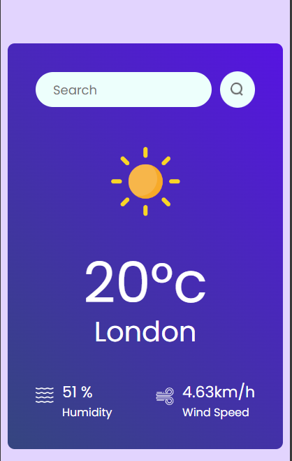

# Weather App

This project is a Weather App built using React JS that fetches current weather data from the OpenWeatherMap API. It displays the weather information such as temperature, weather condition, humidity, and wind speed for a specified city.


## Deployment

To deploy this project run

```bash
  npm run dev
```



## API Reference

#### OpenWeatherMap API 

```http
  REACT_APP_WEATHER_API_KEY = "your_api_key"

```

| Parameter | Type     | Description                |
| :-------- | :------- | :------------------------- |
| `api_key` | `string` | **Required**. Your API key |

Fetches data from OpenWeatherMap and displays the corresponding weather information based on the requested city.


## 🚀 About Me
I'm a full stack developer... 🧑‍💻

Hey, peeps! I'm the ultimate tech geek and Software Engineer in the making. Started coding back in 11th grade – yeah, that's right, way ahead of the curve. My first PC game? Cake Builder. It was the bomb, and if you haven't played it, you're missing out big time.

Fluent in Python, Java, and JavaScript – basically, I can talk to computers better than most people talk to each other. While you're struggling with basic code, I'm out here crafting digital masterpieces. Yeah, it's a talent not everyone has.

When I'm not flexing my coding skills or blowing up your feed with the latest tech hacks, you can find me sleeping under the sky, just chilling. No agenda, no stress, just me and the stars. Pure bliss. Sometimes, I'll even grace the football field with my presence, showing everyone how it's done.

So, follow along if you can keep up. If not, well, try harder. This tech prodigy isn't slowing down for anyone. ✌️


## 🔗 Links
[](https://none-c16111.webflow.io/)
[](https://www.linkedin.com/tanmaymandal13/)
[](https://x.com/iam10mayy)

